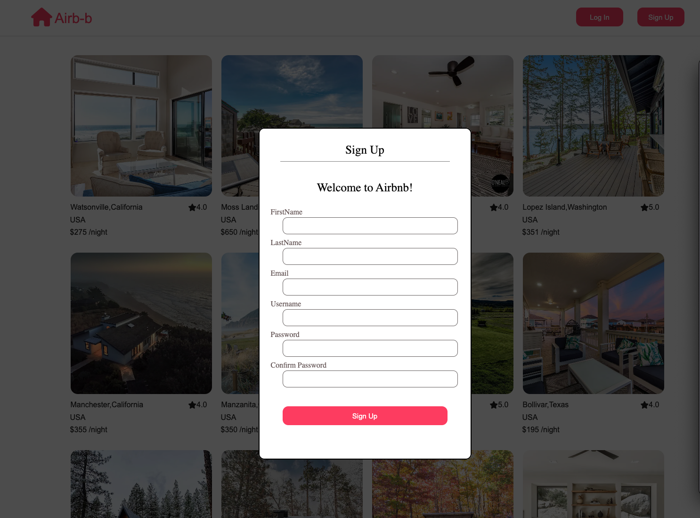
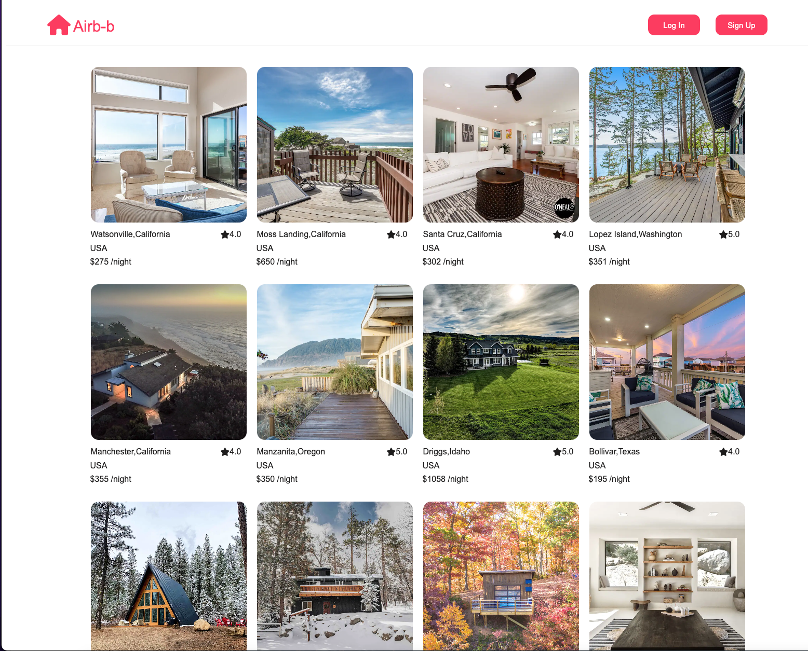
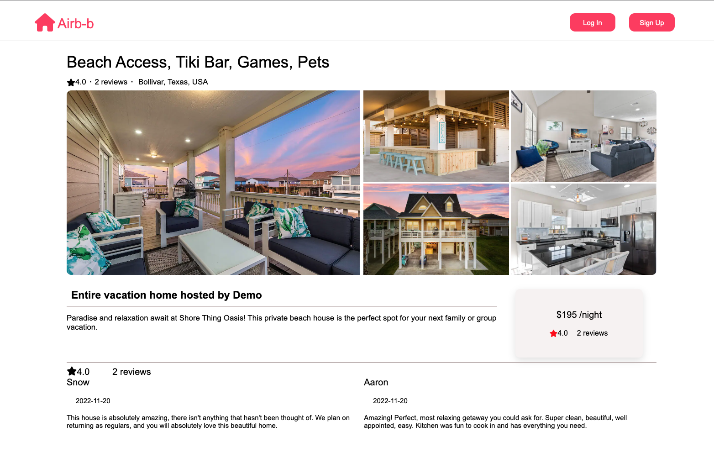

# Airb-b

Airb-b is a website clone, inspired by Airbnb. Airb-b is an online marketplace that connects people who want to rent out their homes with people who are looking for accommodations in specific locales.

Live site: https://airb-b.herokuapp.com/

## WIKI Link:

- [Backend Routes](https://github.com/Alicenanguo/Airb-b/wiki/Backend-Routes)
- [Database Schema](https://github.com/Alicenanguo/Airb-b/wiki/Database-Schema)
- [Feature List](https://github.com/Alicenanguo/Airb-b/wiki/Feature-List)
- [Frontend Routes](https://github.com/Alicenanguo/Airb-b/wiki/Frontend-Routes)

## Tech Stack

Frameworks, Platforms, and Libraries:

  

   

Database:

Hosting:

## Features Driections:

### User Sign Up Page:

### Home Page Demo User:

You will be able to test the features without sign up by click on the 'Demo User' button.

### Spot Details Page:

### Create New Spot Page:

[create new spot](./images/createspot.png)

### User Review Page:
[user review page](./images/userreviewpage.png)

### Create Review:
[create review](./images/createreview.png)
